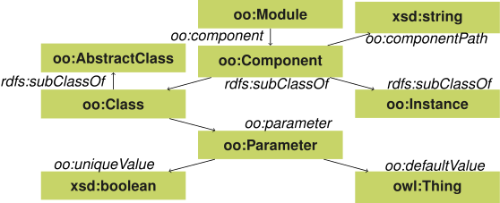
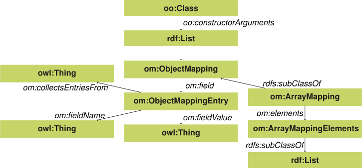

## Declarative Configurations
{:#configs}

Components.js depends on two levels of configuration for enabling the wiring of software components.
The first level is the creation of *components* files,
which are the semantic representation of component constructors,
and can usually be automatically generated.
The second level is the creation of *configuration* files,
which represent the actual instantiation of components
based on the generated components files.
Hereafter, we explain these two levels in more detail.

### Components files

Component files are used to semantically represent the constructors of software components.
For this, we make use of two vocabularies, which will be explained hereafter.
Next, we explain how URLs can be minted for software components, so that they become fully dereferenceable.
Finally, we explain how these component files can be generated automatically from existing TypeScript code.

#### Object-Oriented Components Vocabulary

Components.js distinguishes between three main concepts:

Module
: a software package containing zero or more components. This is equivalent to a Node module or npm package.

Component
: a class that can be instantiated by creating a new instance of that type with zero or more parameter values. Parameters are defined by the class constructor.

Configuration
: a semantic representation of an instantiation of a component into an object instance based on parameters.

These concepts are described in the programming language independent [_Object-Oriented Components vocabulary (OO)_](https://linkedsoftwaredependencies.org/vocabularies/object-oriented) [](cite:citesAsAuthority van2017describing).
This vocabulary enables software components to be instantiated based on certain parameters,
analog to constructor arguments in object-oriented programming.
This is interpreted in the broad sense: only _classes_, _objects_ and _constructor parameters_ are considered.
An overview is given in [](#voc-oo-diagram).

<figure id="voc-oo-diagram">

<figcaption markdown="block">
Classes and properties in the [_Object-Oriented Components vocabulary (OO)_](https://linkedsoftwaredependencies.org/vocabularies/object-oriented), with as prefix `oo`.
</figcaption>
</figure>

A module is considered a collection of components.
Within object-oriented languages, this can correspond to for example a software library or an application.
A component is typed as `oo:Component`, which is a _subclass_ of `rdfs:Class`.
The parameters to construct the component can therefore be defined as an `rdfs:Property` on a component.

<figure id="module-oo" class="listing">
````/code/module-oo.txt````
<figcaption markdown="block">
A description of a module `ex:MyModule` with a single component using the JSON-LD serialization,
compacted with the `https://linkedsoftwaredependencies.org/bundles/npm/componentsjs/^4.0.0/components/context.jsonld` context.
</figcaption>
</figure>

We illustrate the usage of this vocabulary with an example in [](#module-oo) using the [JSON-LD](cite:cites jsonld) serialization.
This listing shows the definition of a new module (`oo:Module`) with compact IRI `ex:MyModule`.
The name of the module is set with the compact IRI `requireName`, which expands to `doap:name` from the [Description of a Project (DOAP) vocabulary](https://github.com/ewilderj/doap/wiki).
Furthermore, our module contains a single class component (`oo:Class`) with compact IRI `ex:MyModule/MyComponent`.
Since this is a class component (subclass of `oo:Component`), this means that this components is instantiatable based on parameters.
Each component can refer to its path within a module using the `oo:componentPath` predicate (compacted as `requireElement`).
Finally, our single component has a parameter (`oo:Parameter`) with compact IRI `ex:MyModule/MyComponent#name`
that can be set when instantiating this component.

Since components and parameters are defined as RDFS vocabulary,
we can instantiate components easily using the `rdf:type` predicate,
and by using parameters as predicates on such new instances, as shown in [](#instance-oo).
Instead of passing literals as values to parameters, it is also possible to pass _other component instances_ as values,
thereby allowing nested component instantiations to be defined.

<figure id="instance-oo" class="listing">
````/code/instance-oo.txt````
<figcaption markdown="block">
Instantiation of `ex:MyModule/MyComponent` using a value for the parameter `ex:MyModule/MyComponent#name`.
</figcaption>
</figure>

#### Object Mapping Vocabulary

As shown in the previous section, the OO vocabulary allows modules, components, and parameters to be defined,
so that instances of components can be declared.
However, this vocabulary only defines parameter values for component instances,
but it does not define how these parameter values are used to invoke the constructor of this component.
To enable this, we introduce the accompanying [_Object Mapping vocabulary (OM)_](https://linkedsoftwaredependencies.org/vocabularies/object-mapping){:.mandatory}.
[](#voc-om-diagram) shows an overview of all its classes and predicates.

<figure id="voc-om-diagram">

<figcaption markdown="block">
Classes and properties in the [_Object Mapping_ vocabulary](https://linkedsoftwaredependencies.org/vocabularies/object-mapping#), with as prefix `om`.
</figcaption>
</figure>

The OM vocabulary makes use of the `oo:constructorArguments` predicate for the domain `oo:Class`,
and thereby builds upon the OO vocabulary via the `oo:constructorArguments` extension point to define the class constructor's behaviour.
Concretely, this new vocabulary defines a mapping between the component parameters as defined using the OO vocabulary,
and the raw objects that are passed into the constructor during instantiation.

In essence, this vocabulary enables an (RDF list) of `om:ObjectMapping`'s to be passed to the `oo:constructorArguments` of an `oo:Class`.
An `om:ObjectMapping` represents an object containing zero or more key-value pairs, which are represented by `om:ObjectMappingEntry`.
`om:ArrayMapping` is a special type of `om:ObjectMapping` that represents an array, where its elements can be other `om:ObjectMapping`'s.

<figure id="module-om" class="listing">
````/code/module-om.txt````
<figcaption markdown="block">
A description of a module `ex:MyModule` with a single component having constructor arguments using the JSON-LD serialization,
compacted with the `https://linkedsoftwaredependencies.org/bundles/npm/componentsjs/^4.0.0/components/context.jsonld` context.
</figcaption>
</figure>

Building upon the OO example from [](#module-om), we illustrate the usage of this vocabulary with an example in [](#module-om), again using the JSON-LD serialization.
The only difference with the previous example, is the addition of the `constructorArguments` block,
which expands to `oo:constructorArguments` that is configured to always contain an RDF list.
The constructor arguments contain a single `om:ObjectMapping`, which is implied by the presence of `field`, which expands to `om:field`.
Since the field array contains just a single element (`om:ObjectMappingEntry`),
it represents an object with a single key and value.
The key is defined by `keyRaw` (expands to `om:fieldName`), which contains the constant `name`.
The value is defined by `value` (expands to `om:fieldValue`), which refers to the `ex:MyModule/MyComponent#name` parameter.

The addition of an object mapping to a component requires no changes as to how a component is instantiated,
which means that our component from [](#module-om) can still be instantiated in the exact same way as the one from [](#module-oo).
The only difference now, is that we are able to determine how exactly the parameter values are to be used for invoking the component constructor.
For example, the instantiation of [](#instance-oo) corresponds to the following code in JavaScript: `new MyComponent({ name: 'Some name' })`

#### Dereferenceability

Write me: via LSD
{:.todo}

#### Generation from TypeScript

Write me
{:.todo}

### Configuration files

Write me
{:.todo}
