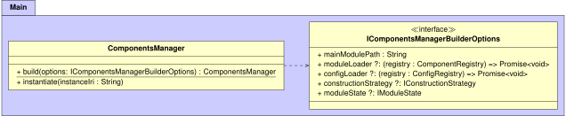
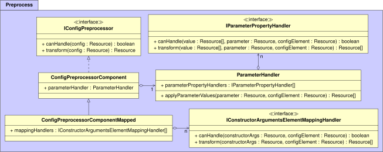

## Dependency Injection Framework
{:#system}

Building on top of the declarative configurations that were explained in previous section,
we now discuss Components.js, which is a system that can interpret these configurations
for enabling dependency injection within JavaScript/TypeScript projects.
In this section, we first explain the main architecture, followed by the most relevant implementation details.
Next, we first explain the main API that allows developers to use this tool.

### Architecture

Internally, the Components.js dependency injection tool goes through three main phases:

* Loading: Initialization of DI components, discovery of modules, and loading of configuration files.
* Preprocessing: Handling of constructor arguments.
* Construction: Instantiation of JavaScript classes based on configuration files.

These three phases are handled by the `ComponentsManager`,
which acts as the main entrypoint of the framework.
This manager class is constructed via a static `build` method,
via which custom options can be passed,
such as a callback for loading modules and configuration files.

For the sake of clarity, all UML architecture diagrams that we include in this article
only contain simplified representations of the actual classes.
So there may be minor differences when comparing the diagrams with the actual source code.

<figure id="architecture-main">

<figcaption markdown="block">
UML diagram of the classes within the main package,
which contains the main entrypoint of the framework.
</figcaption>
</figure>

Hereafter, we explain these three phases in more detail.

#### Loading

When the `ComponentsManager` is being built,
the loading phase will be initiated,
which will make use of the classes within the load package.
The most important classes within this package are shown in .

<figure id="architecture-load">

<figcaption markdown="block">
UML diagram of the classes within the load package,
which are responsible for loading components and configurations.
</figcaption>
</figure>

The `ModuleStateBuilder` is a class that is responsible for scanning the current JavaScript project and its dependencies.
The main objective of this class is to build a `IModuleState`, that contains information such as the paths to available components and dependencies.

`ComponentRegistry` and `ConfigRegistry` are classes that are exposed via a callback to invokers of `ComponentsManager.build()`.
These classes respectively enable modules and configurations to be registered,
after they will be loaded.

#### Preprocessing

Before a configuration is instantiated during the construction phase,
it always goes through a preprocessing phase.
Concretely, this involves processing all parameters and constructor arguments,
for which the most relevant classes and interfaces are shown in .

<figure id="architecture-preprocess">

<figcaption markdown="block">
UML diagram of the classes within the preprocess package,
which are responsible for preprocessing config parameters and constructor arguments.
</figcaption>
</figure>

`IConfigPreprocessor` is an interface that represents a preprocessing algorithm for a configuration,
and can have multiple implementations.

`ConfigPreprocessorComponent` is a preprocessor that is able to determine what component is being instantiated within a configuration.
It will check if the linked component exists, and it will validate all passed parameters.
For this parameter validation, the `ParameterHandler` class is used,
which works based on a list of `IParameterPropertyHandler`'s.
For instance, parameter property handlers exist for validating the range of parameters,
checking the uniqueness, handling default values, and more.

`ConfigPreprocessorComponentMapped` is another preprocessor that builds upon `ConfigPreprocessorComponent`,
so that it _additionally_ handles constructor arguments as defined by the Object Mapping vocabulary.
Concretely, after validating parameters, it will handle the constructor arguments recursively
using a list of `IConstructorArgumentsElementMappingHandler`'s.
These handlers can handle specific types of constructor arguments and parameters,
such as the conversion of `om:ObjectMapping` to an object,
and the conversion of `om:ArrayMapping` to an array.

The end-result of the preprocessing phase is a configuration that represents
the raw constructor call of a class, together with the required arguments.

#### Construction

The construction phase is responsible for instantiating a configuration.
The main classes for this are shown in .

<figure id="architecture-construct">

<figcaption markdown="block">
UML diagram of the classes within the construct package,
which are responsible for instantiating configs according to a certain strategy.
</figcaption>
</figure>

`ConfigConstructorPool` is the main entrypoint that is used when a user instantiates a configuration via `ComponentsManager.instantiate()`.
Before actually instantiating a config,
it will first check if it had been instantiated before,
in which case it returns it from a cache.
This may occur for nested configurations that reuse the same component in different places.
If the config has not been instantiated before,
it will first go through the preprocessing phase as explained in the previous section,
after the processed config will be passed on to the `ConfigConstructor`.

The `ConfigConstructor` is able to convert the representation of a class constructor call into an actual constructor call to obtain an object.
For this, the arguments of the constructor are first converted into actual objects,
which is done via a list of `IArgumentConstructorHandler`'s.
For example, handlers exist to handle primitive values such as strings and numbers,
arrays, and references to other components (which requires a recursive call to `ConfigConstructorPool`).
Once the arguments have been resolved, the constructor can be applied to obtain the final instantiated object.

By default, the `ConfigConstructor` assumes that configurations are instantiated via the [CommonJS JavaScript standard](https://nodejs.org/docs/latest/api/modules.html){:.mandatory},
which is primarily used by the Node.js framework.
However, Components.js has been designed to handle different kinds of instantiation,
which can be done via different `IConstructionStrategy`'s.
For instance, this allows the framework to be compatible with other upcoming JavaScript standards such as [JavaScript modules](https://developer.mozilla.org/en-US/docs/Web/JavaScript/Guide/Modules){:.mandatory}.

### Implementation

Components.js has been implemented in TypeScript,
and is available on [GitHub](https://github.com/LinkedSoftwareDependencies/Components.js){:.mandatory}
under the MIT license.
At the time of writing, the latest release is at version 4.4.1,
which is published via the [npm package manager](https://www.npmjs.com/package/componentsjs){:.mandatory}.

Due to the critical nature of this framework,
it is being tested thoroughly.
At the time of writing, it consists of 538 unit tests,
which reach a test coverage of 100%.

Components.js is being maintained by IDLab via software projects that make use of this framework.
A sustainability of this project is available on [GitHub](https://github.com/LinkedSoftwareDependencies/Components.js/wiki/Sustainability-Plan){:.mandatory}.

Finally, in-depth documentation is [available](https://componentsjs.readthedocs.io/en/latest/){:.mandatory},
which explains how to create component and configuration files,
and how to invoke the DI tool.

### API

How it is used
{:.todo}
