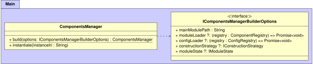
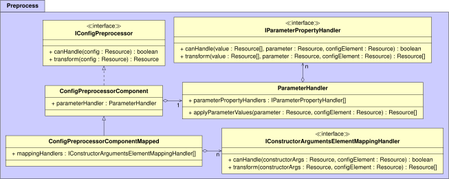
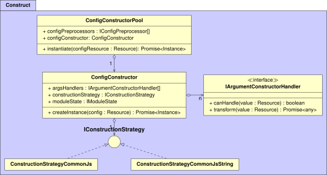

## Architectural Diagrams
{:#uml-diagrams}

This appendix section contains the architectural diagrams that were discussed in .
 contains the main entrypoint of the framework,
 represents the loading phase,
 represents the preprocessing phase,
and  represents the construction phase.

<figure id="architecture-main">

<figcaption markdown="block">
UML diagram of the classes within the main package,
which contains the main entrypoint of the framework.
</figcaption>
</figure>

<figure id="architecture-load">

<figcaption markdown="block">
UML diagram of the classes within the load package,
which are responsible for loading components and configurations.
</figcaption>
</figure>

<figure id="architecture-preprocess">

<figcaption markdown="block">
UML diagram of the classes within the preprocess package,
which are responsible for preprocessing config parameters and constructor arguments.
</figcaption>
</figure>

<figure id="architecture-construct">

<figcaption markdown="block">
UML diagram of the classes within the construct package,
which are responsible for instantiating configs according to a certain strategy.
</figcaption>
</figure>
